# Multilingual Toxicity Detector
NLP deep learning model for toxicity detection in text (English, Spanish, Turkish, Russian, French, Portuguese, Italian), trained  on a TS-877 Ryzen-based NAS with 8 cores and 16 threads, with a GeForce GTX 1060 6GB graphics card. 
This repo includes the serving of the model with Tensorflow + Flask + AJAX.

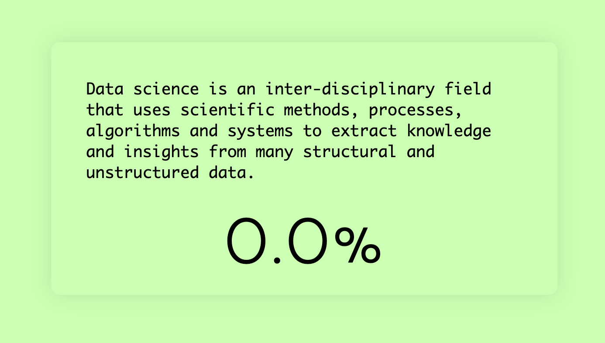

### The model
The input is ingested by a Distilbert Transformer (from [@huggingface](https://github.com/huggingface/transformers)) previously being tokenized by the corresponding tokenizer. Then, the embeddings enter a Funnel component, which models (non-)linear combinations starting from the embedding up to the final node, which contains a neuron with a sigmoid activation function that predicts the toxicity for the given input. 

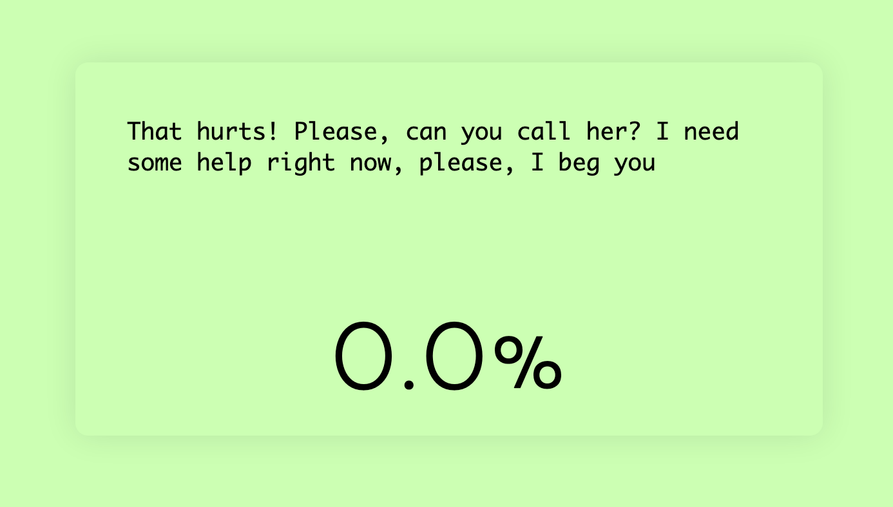
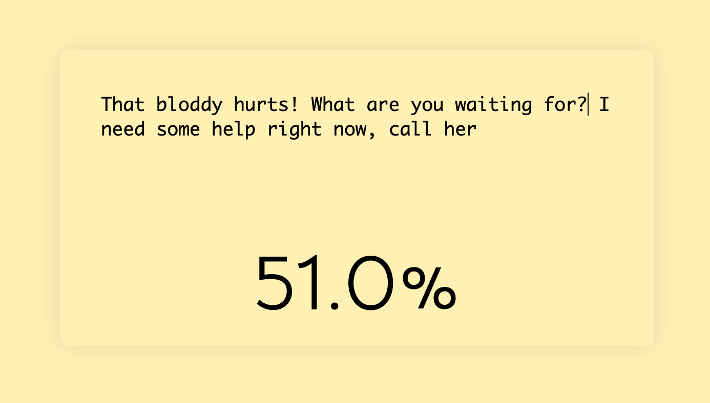

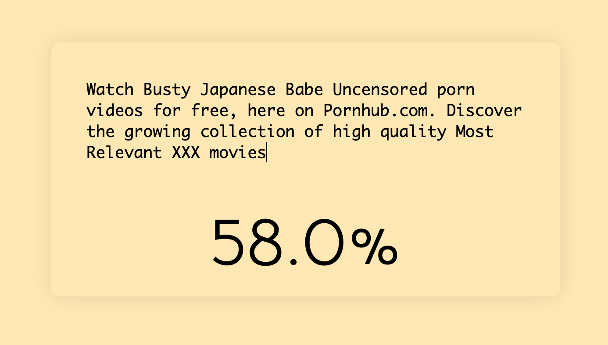
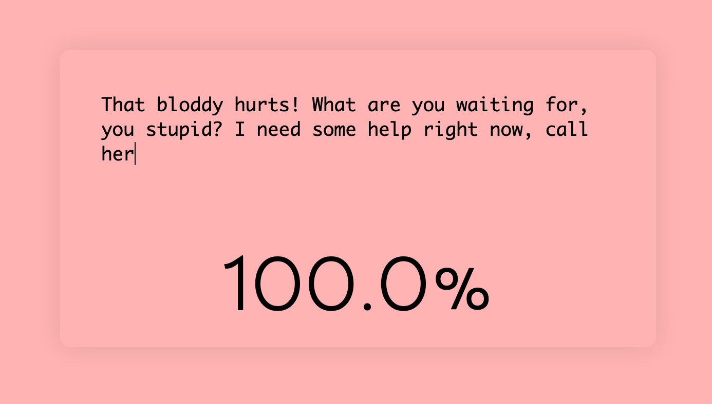

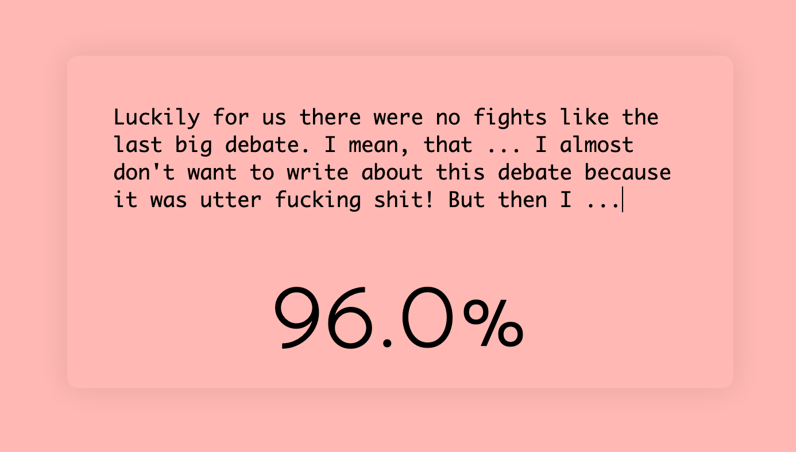
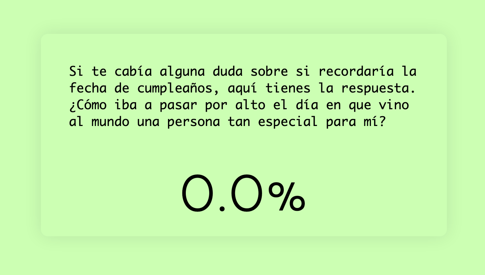

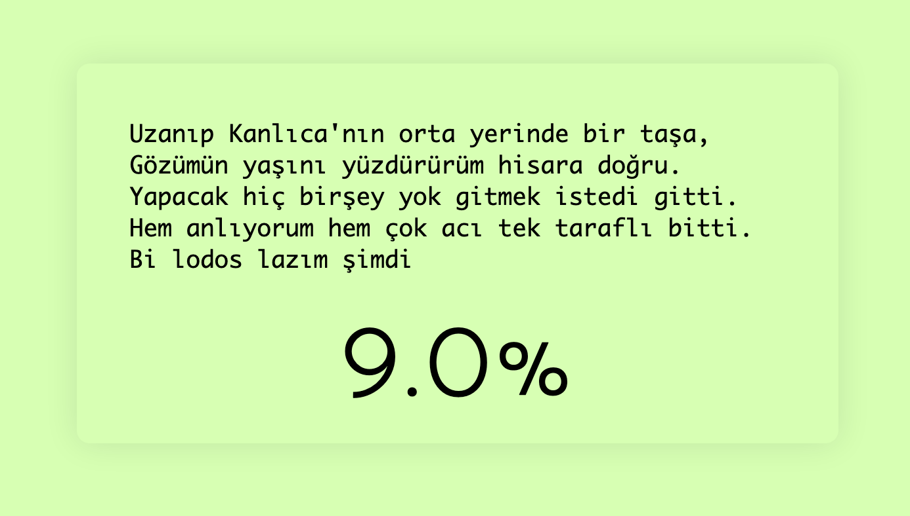
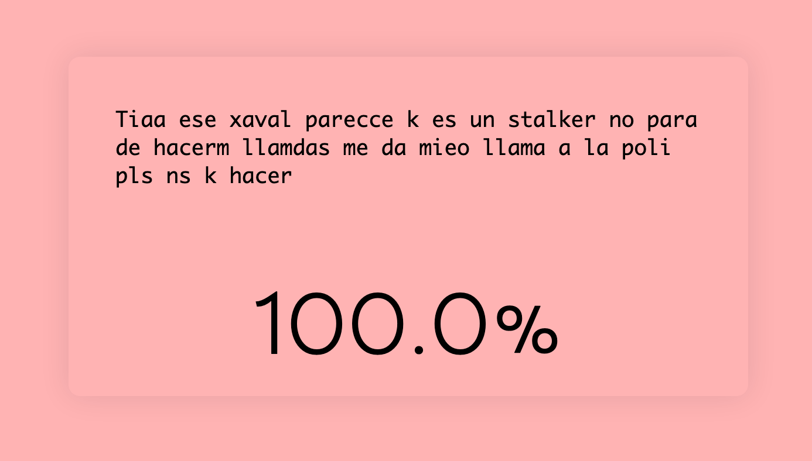

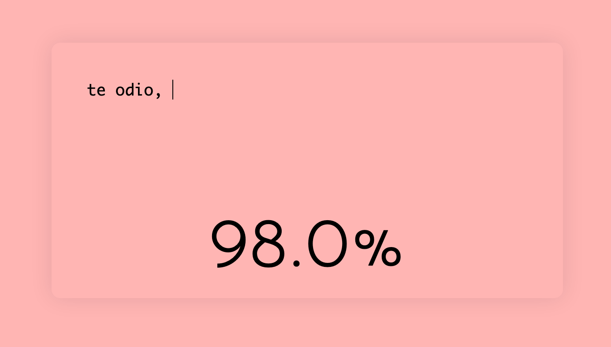
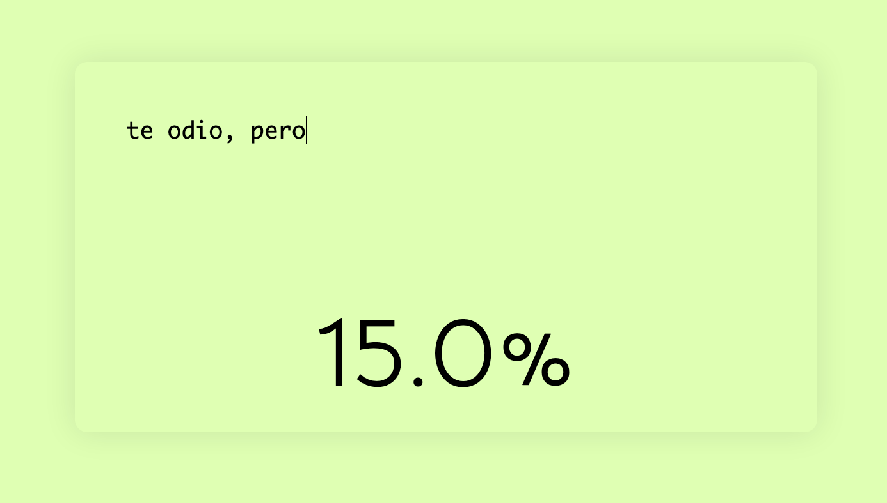

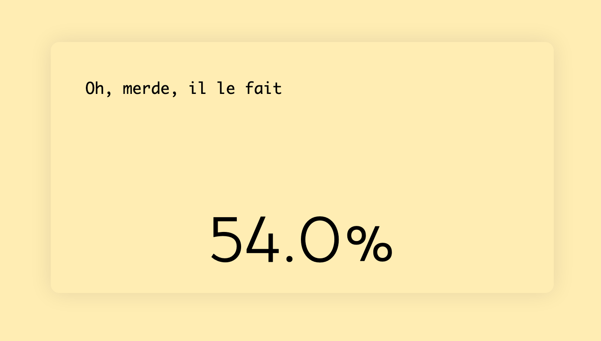
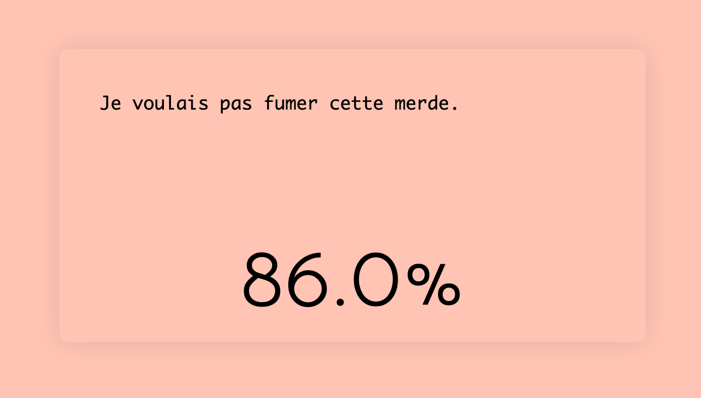

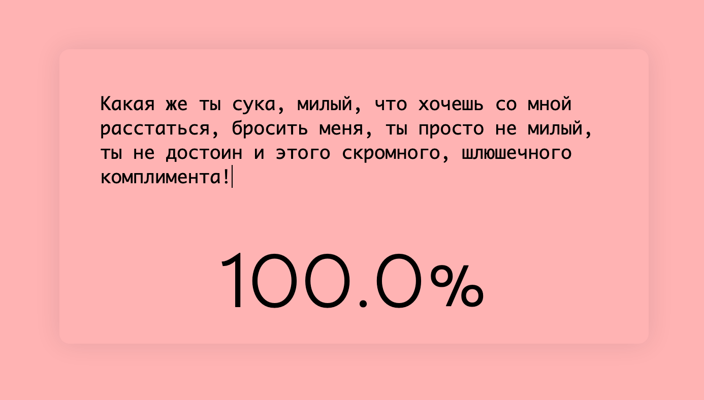
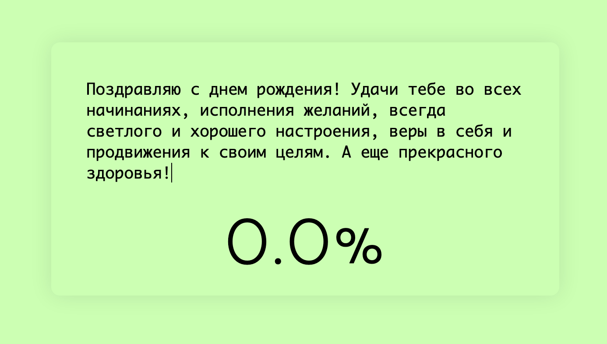

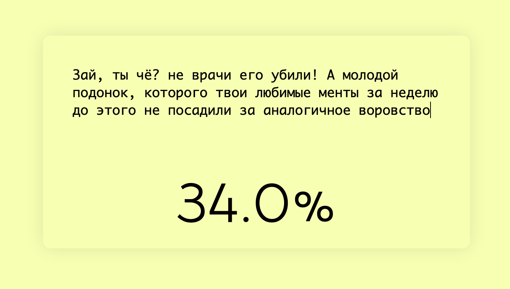
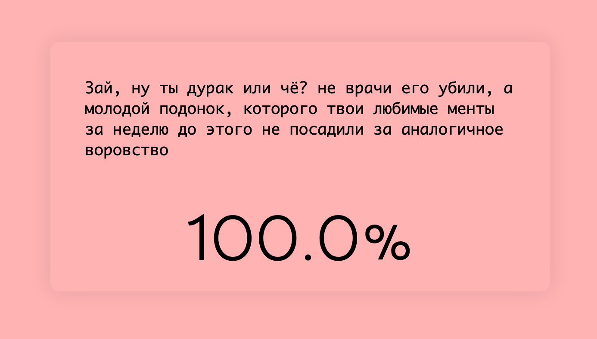

